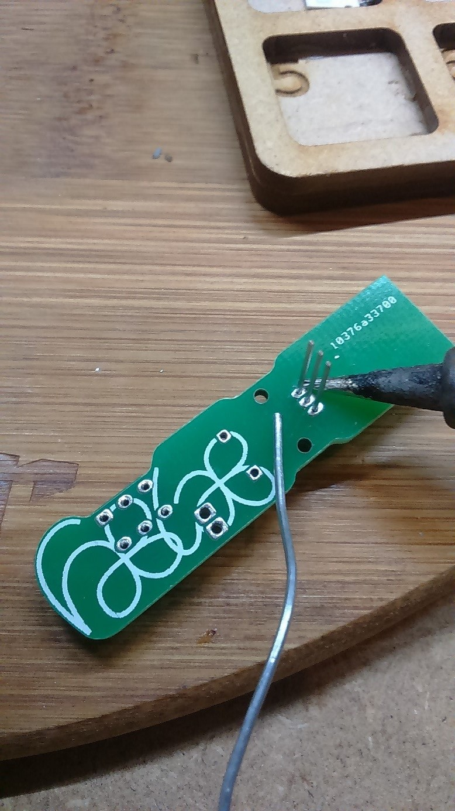
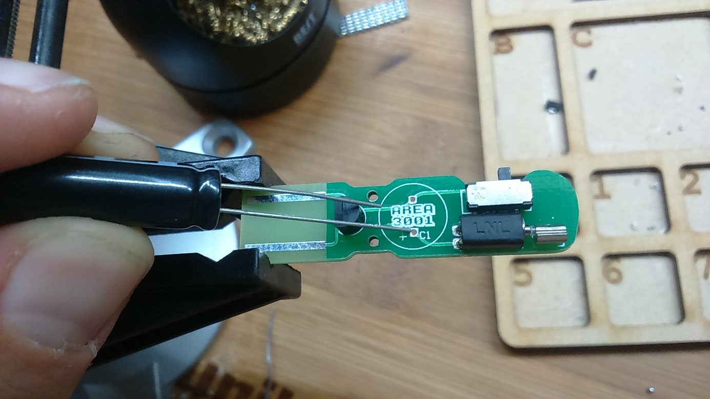
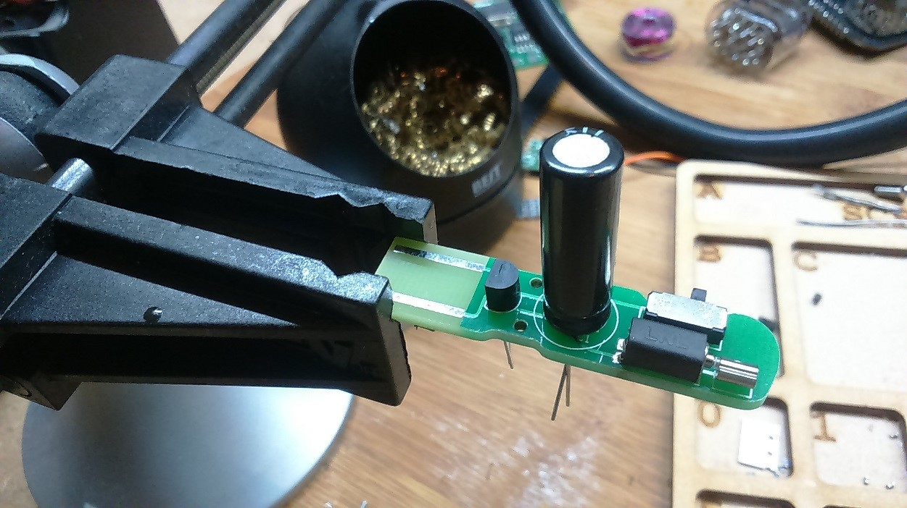

# FABLAB_BOT_00 Soldering instructions

 
### Place the LDO and slider switch on the circuit board and solder them.

 
### Place the vibration motor on the board.
 

 
### Place the large capacitor. Pay extra attention to the orientation! The long lead is the + lead.

 
### Verify the capacitor before soldering it!

     
### Now it’s time to shorten all those long leads.

### Caution! Hold the pins before cutting them to prevent them from flying everywhere!

 
### Make sure everything looks clean and verify that there are no short circuits.

### Now it’s time to charge the bot for the first time.

