# FABLAB_BOT_00 Soldeer instructies

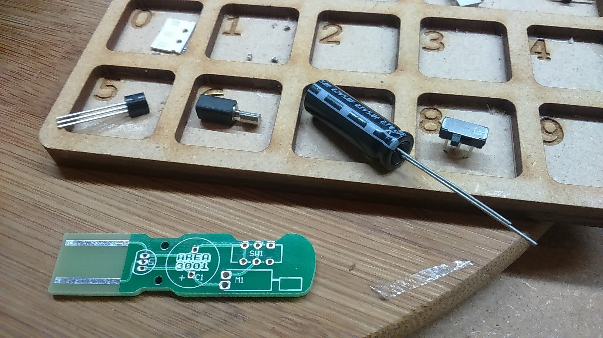
 
## Plaats de LDO en schakelaar in de print en soldeer deze alvast.

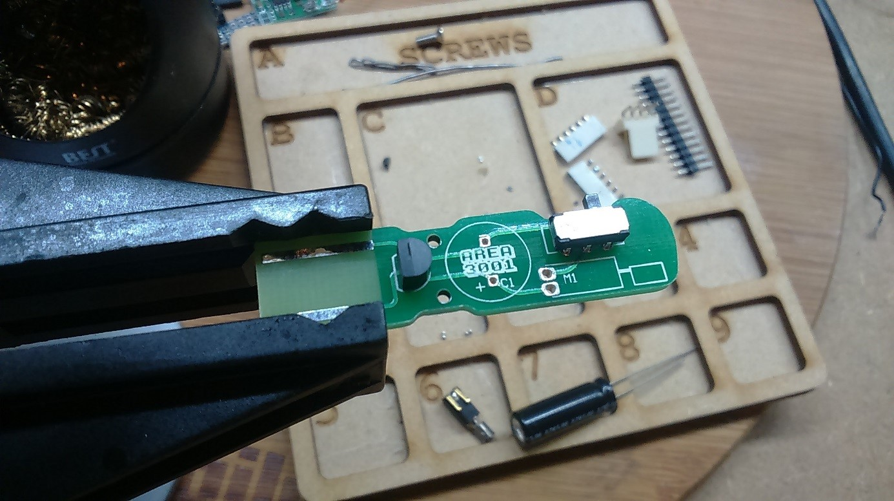
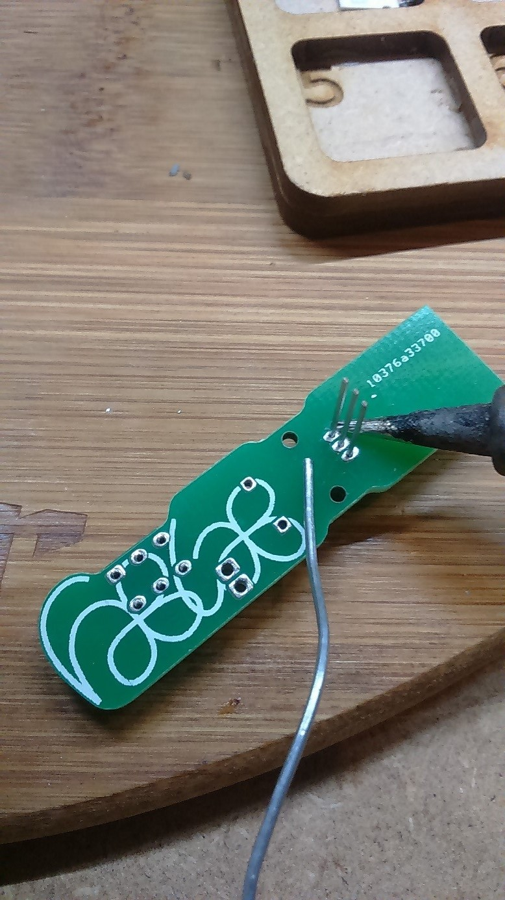
 
## Plaats de motor op de print.
 
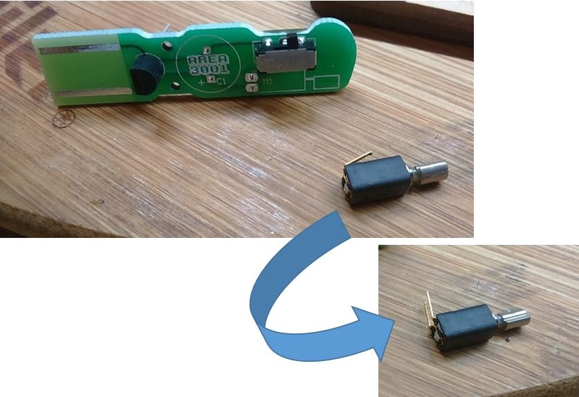
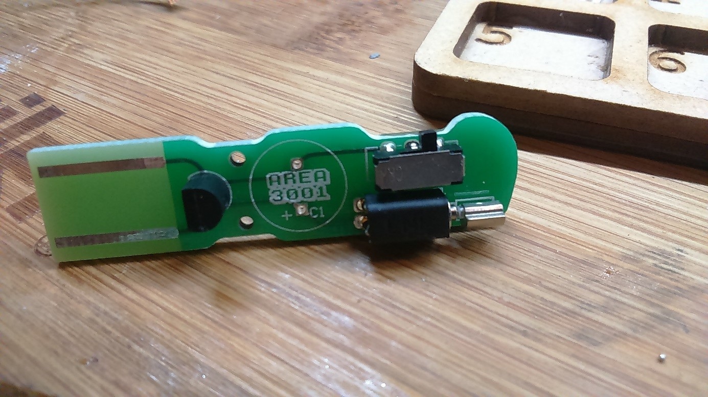
 
## Plaats de condensator, let hierbij op de richting! De lange pin is de + pin.

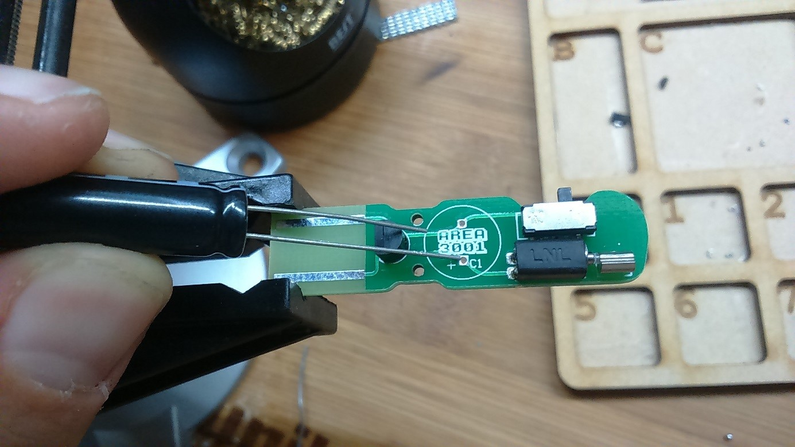
 
## Kijk goed na hoe de condensator zit voor je hem gaat solderen!

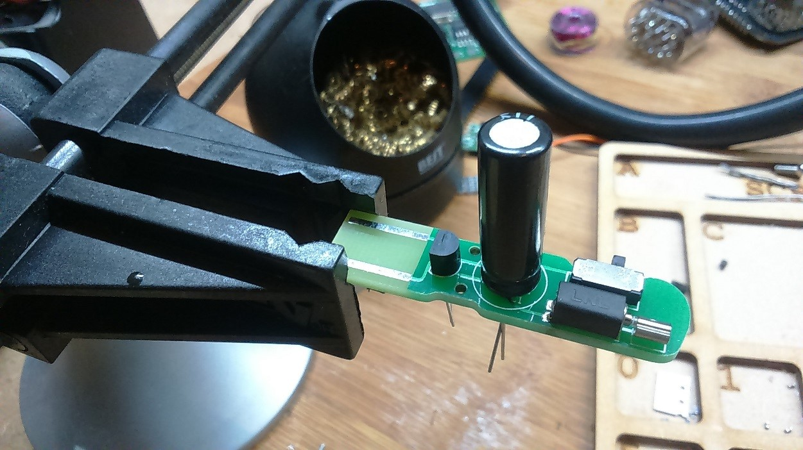
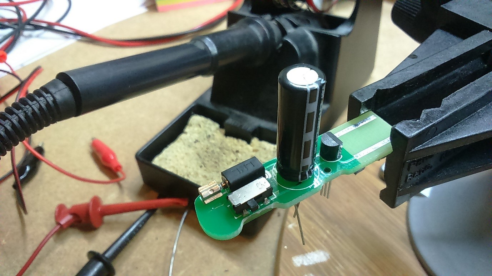
     
## Tijd om de lange pinnen in te korten!

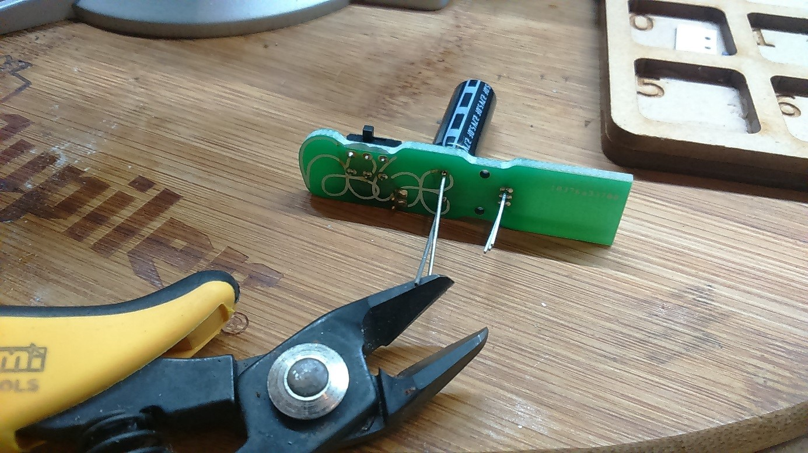

## Opgelet! Houd de pinnen tegen met je hand, anders vliegen ze weg!

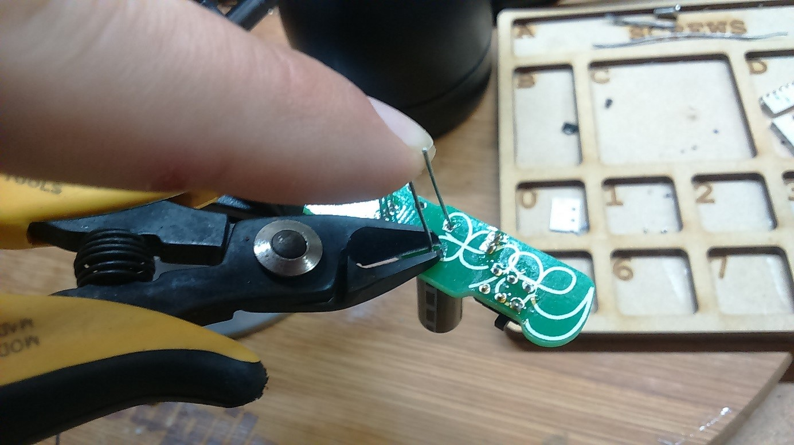
 
## Kijk goed na dat alles er proper uit ziet en er geen kortsluitingen zijn.

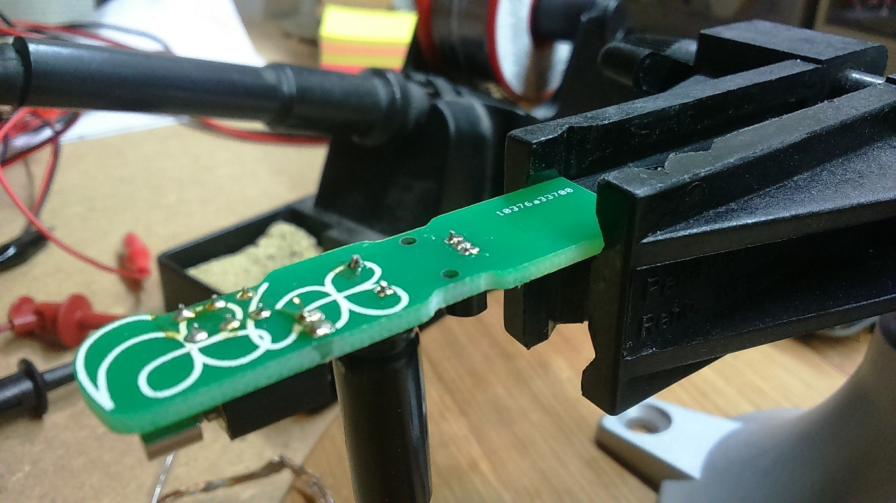

## Tijd om hem de eerste keer op te laden in een USB Hub.

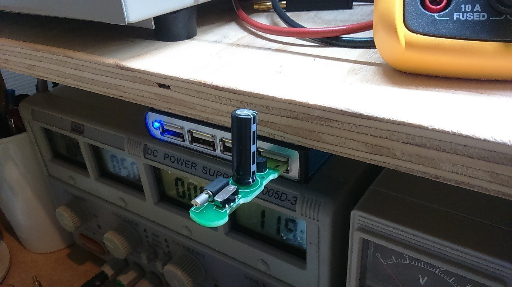
